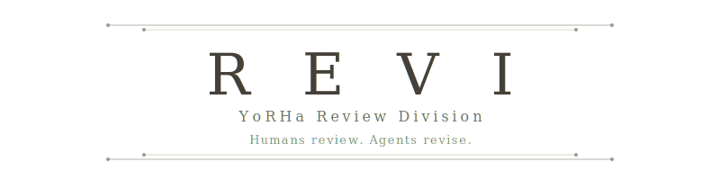
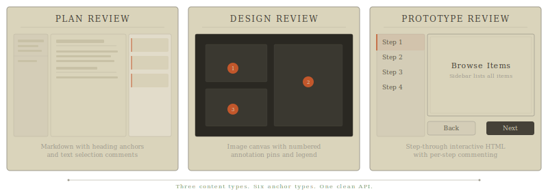
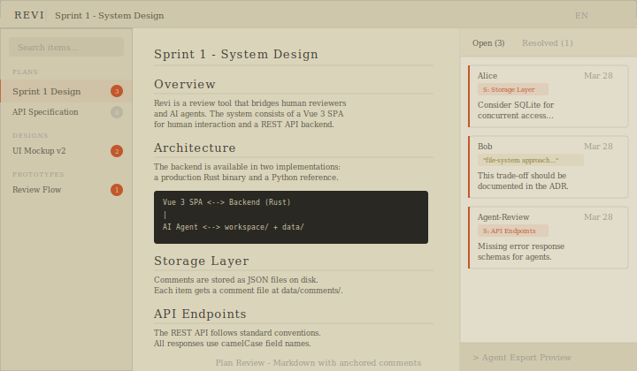
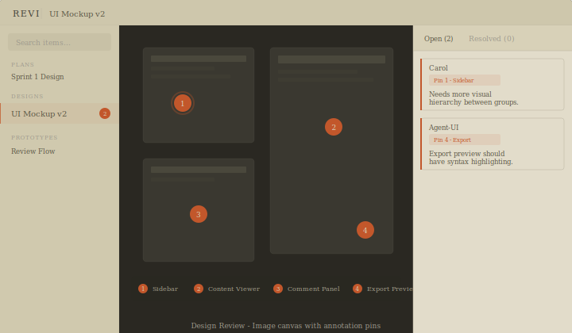

<p align="center">
  
</p>

<p align="center">
  <a href="https://www.rust-lang.org"></a>
  <a href="https://vuejs.org"></a>
  <a href="https://www.python.org"></a>
  <a href="https://yorha-agents.github.io/Revi/"></a>
  <a href="https://yorha-agents.github.io/Revi/demo/"></a>
</p>

---

Revi bridges the gap between human reviewers and AI agents. Reviewers browse markdown plans, design mockups, and interactive HTML prototypes in a split-pane UI, leaving **anchored comments** pinned to specific headings, text selections, image annotation pins, or prototype steps. Agents consume a structured JSON export at `/api/export/{item_id}` that surfaces only open feedback with anchor references — read, act, resolve, repeat.

<p align="center">
  <a href="https://yorha-agents.github.io/Revi/demo/"><em>Try the interactive demo →</em></a>
</p>

---

## Preview

<p align="center">
  
</p>

<table>
  <tr>
    <td width="50%">
      
    </td>
    <td width="50%">
      
    </td>
  </tr>
  <tr>
    <td align="center"><em>Plan Review — markdown with anchored comments</em></td>
    <td align="center"><em>Design Review — canvas with annotation pins</em></td>
  </tr>
</table>

---

## Features

| | Feature | Description |
|---|---------|-------------|
| I | **Plan Review** | Render markdown with heading anchors, text selection comments, inline search, and collapsible document index |
| II | **Design Review** | Display images on a dark canvas with numbered annotation pins and hover-linked comment cards |
| III | **Prototype Review** | Step-through interactive HTML prototypes with per-step commenting and zoom/pan support |
| IV | **Agent Export API** | `GET /api/export/{item_id}` returns only open comments as structured JSON — purpose-built for LLM agents |
| V | **Anchored Comments** | Six reference types: `section`, `quote`, `line`, `annotation`, `step`, `general` |
| VI | **Zero-Dependency Binary** | Single static Rust binary — no runtime, no containers, just run it |

## Quick Start

### Option A — Pre-built binary (recommended)

```bash
# Linux x86-64
./dist/revi-linux-x86_64

# macOS Apple Silicon
./dist/revi-macos-aarch64
```

Auto-creates `~/.revi/workspace/` and `~/.revi/data/` on first run. Then start the frontend:

```bash
cd frontend && npm install && npm run dev
# → http://localhost:5173
```

### Option B — Python backend (development)

```bash
cd backend && pip install -e ".[dev]"
uvicorn backend.main:app --reload --port 8000

# In another terminal:
cd frontend && npm install && npm run dev
```

### Configuration

```bash
./revi --workspace /my/docs --data /my/data --port 9000
```

```toml
# revi.toml (next to binary or ~/.config/revi/config.toml)
workspace = "/my/docs"
data      = "/my/data"
port      = 9000
```

## Architecture

```
┌──────────────┐     REST API      ┌────────────────────────┐
│  Vue 3 SPA   │ ←───────────────→ │  Rust binary (revi)    │
│  (port 5173) │                   │  or FastAPI backend     │
└──────────────┘                   │  (port 8000)            │
                                   ├────────────────────────┤
                                   │  workspace/             │
┌──────────────┐     JSON export   │    plans/*.md           │
│  AI Agent    │ ←───────────────→ │    designs/*.png        │
│  (any LLM)   │                   │    prototypes/*.html    │
└──────────────┘                   ├────────────────────────┤
                                   │  data/                  │
                                   │    comments/*.json      │
                                   │    archive/*.json       │
                                   └────────────────────────┘
```

## Agent Integration

Agents interact through a simple REST loop:

```bash
# 1. Fetch open feedback
curl http://localhost:8000/api/export/plans/sprint-1-design

# 2. Add a comment
curl -X POST http://localhost:8000/api/comments/plans/sprint-1-design \
  -H "Content-Type: application/json" \
  -d '{"author":"Agent","content":"Needs error handling","reference":{"type":"section","value":"## API"}}'

# 3. Resolve after acting on it
curl -X PATCH http://localhost:8000/api/comments/plans/sprint-1-design/COMMENT_ID/resolve

# 4. Archive resolved batch
curl -X POST http://localhost:8000/api/archive/plans/sprint-1-design
```

The `item_id` format is `{subfolder}/{stem}` — e.g. `plans/sprint-1-design`, `designs/ui-mockup-v1`.

## API Reference

| Method | Path | Description |
|--------|------|-------------|
| `GET` | `/api/reviews` | List all review items with comment counts |
| `GET` | `/api/reviews/{item_id}` | Item detail with content |
| `GET` | `/api/export/{item_id}` | Agent export — open comments as structured JSON |
| `POST` | `/api/comments/{item_id}` | Add a comment |
| `PATCH` | `/api/comments/{item_id}/{id}/resolve` | Resolve a comment |
| `POST` | `/api/archive/{item_id}` | Archive all resolved comments |
| `GET` | `/api/archive/{item_id}` | List archived batches |
| `POST` | `/api/upload/{subfolder}` | Upload a file to workspace |
| `GET` | `/api/config` | View server config |
| `PATCH` | `/api/config` | Update config |

## Workspace Structure

Drop files into the right subfolder — Revi auto-discovers them by type:

```
workspace/
  plans/        →  Markdown documents rendered with heading anchors
  designs/      →  Images displayed with annotation pins
  prototypes/   →  HTML files shown as step-through viewers
```

## Guides

| Guide | Description |
|-------|-------------|
| [User Guide](docs/user-guide.md) | UI walkthrough for human reviewers — workspace setup, navigation, commenting, archiving |
| [Agent API Guide](docs/agent-guide.md) | Full endpoint reference, schemas, reference types, and polling strategies for AI agents |
| [Deploy Pages](docs/deploy-pages.md) | Step-by-step guide to deploying the GitHub Pages landing site and demo |
| [Load Testing](docs/load-test.md) | Locust-based performance testing — smoke, normal, peak, and soak scenarios |

## Development

### Build from source

```bash
# Run tests
make test-rust            # 53 integration tests
cd frontend && npm test   # Vitest unit tests

# Build binaries
make build-macos          # → dist/revi-macos-aarch64
make build-linux          # → dist/revi-linux-x86_64

# Dev server
make dev-rust
```

### Frontend

```bash
cd frontend
npm run dev          # Vite dev server on :5173
npm run build        # Production build
npm test             # Unit tests
npm run test:e2e     # Playwright E2E tests
```

### Environment

| Variable | Default | Description |
|----------|---------|-------------|
| `VITE_API_BASE` | `http://localhost:8000` | Backend URL |

## Tech Stack

| Layer | Technology |
|-------|-----------|
| Frontend | Vue 3 · Vue Router · Vue I18n · Vite |
| Backend (primary) | Rust · Axum · Tokio · Serde |
| Backend (reference) | Python · FastAPI · Pydantic |
| Testing | Vitest · Playwright · Cargo test · Locust |

---

<p align="center">
  <em>Humans review. Agents revise.</em>
</p>
